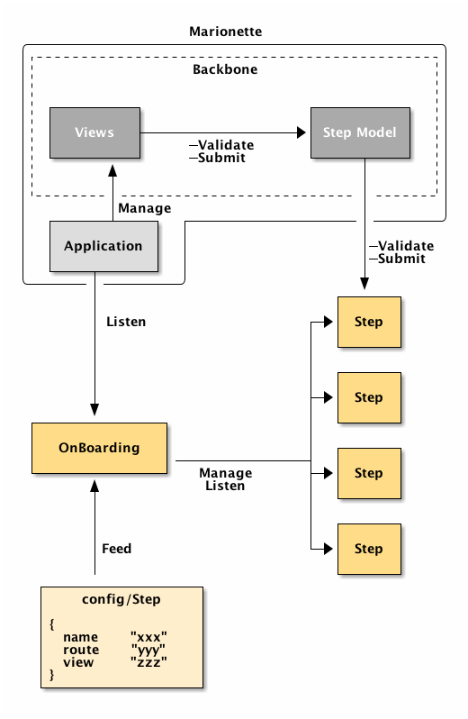

## Onboarding component

### Modelisation naive diagram


### Onboarding class

This class, located in `lib/onboarding`, is an agnostic and framework free onboarding manager. It manages the different steps of onboarding and handle event triggered by steps object.

This class has to facilitate migration to another framework in the future. At this time, the framework used is Backbone/Marionette and Onboarding is implemented like a classical POO object.

### Step objects
Step objects are simple configuration JavaScript object declared in separated files. Their role is to describe each onboarding step, with properties, but also with methods when needed, as validation methods for example. They are located in `steps` directory.

#### Step class

The class represents an onboarding step, for example the greetings step or the password definition step.

It takes as parameter a simple JavaScript object described in previous paragraph.
It also ensures that each step will have defaults mandatory methods like `submit`.

However, it will be possible to override class methods in config objects (not implemented yet).

---

## Properties
### Onboarding
#### initialize(user, steps, currentStepName)
##### Parameters
* `user`: JS object representing user's properties
* `steps`: Array of JS object representing steps
* `currentStepName`: String reprensenting the current (or first) step in onboarding.

Set the user and the steps list for the current onboarding.
Called by the constructor method.
The steps list should look like :
```javascript
[{
    name: 'Step 1', // Name should be unique
    route: 'step1', // URL segment
    views: 'steps/step1' // path to the view, but maybe it is too much  framework-specific and we should compute the view's path.
},{
    name: 'Step 2',
    route: 'step2',
    views: 'steps/step2'
}]
```

#### onStepChanged(callback)
##### Parameters
* `callback`: function

Record the callback function as handler for every time the current onboarding step will __change__.

#### onStepFailed(callback)
##### Parameters
* `callback`: function

Record the callback function as handler for every time the current onboarding step will __fail__.

#### onDone(callback)
##### Parameters
* `callback`: function

Record the callback function as handler for when all onboarding steps will be completed with sucess (the whole onboarding process is done). It can be see as the last callback function to be run at the very end of the onboarding process.

#### handleStepCompleted()
Handler for 'stepSubmitted' pseudo-event, triggered by a step when it has been successfully submitted.

#### goToNext()
Select the next step on the list and trigger the related events.

#### goToStep(step)
##### Parameters
* `step`: Step

Go to the given step. Fetch data related to step by calling `fetchData`. If it's a success, trigger `stepChanged` pseudo-event (i.e. call `triggerStepChanged` method).

#### triggerStepChanged(step)
##### Parameters
* `step`: Step

Trigger a 'StepChanged' pseudo-event. Run all `stepChangedHandlers` handlers when the current step is changed.

#### handleStepError(step, err)
##### Parameters
* `step`: Step
* `err`: error object when failure

Handler for 'stepFailed' pseudo-event, triggered by a step when it has been failed.

#### triggerStepErrors(step, err)
##### Parameters
* `step`: Step
* `err`: error object when failure

Trigger a 'StepFailed' pseudo-event. Run all `stepFailedHandlers` handlers when the current step is failed.

#### triggerDone(err)
##### Parameters
* `err`: error object when failure

Trigger a 'onboardingDone' pseudo-event. Run all `onDoneHandler` handlers when the whole onboarding process is finished by the user.

#### getStepByName(stepName)
##### Parameters
* `stepName`: String

Returns a step by its name.

#### getProgression(step)
#### Parameters
* `step`: Step

Returns a JS object representing the progression in onboarding for the given `step`. This object contains the following properties :
* `current` (int): The current index, from 1 to the number of steps in the onboarding. 0 means that the step is not in the onboarding steps list.
* `total` (int): Total number of steps in the onboarding.
* `labels` (Array): Used for accessibility in views. It an ordered list of all the step names. Should be used as keys for Transifex.

#### getNextStep(step)
##### Parameters
* `step`: Step

Returns the next Step in onboarding step list.

Returns null if the given step is the last one.

Throw error if step does not exist in onboarding step list or if step parameter is missing.

#### getCurrentStep()

Returns onboarding's current step.

#### Example
```javascript
let user = retrieveUserInAWayOrAnother();
let step1Options = {name: 'example1'};
let step2Options = {name: 'example2'};

let onboarding = new Onboarding(
    user,
    [step1Options, step2Options]
);

let step2 = onboarding.getStepByName('example2');
let progression = onboarding.getProgression(step);
```

And the `progression` will be:

```javascript
{
    current: 2,
    total: 2,
    labels: ['example1', 'example2']
}
```

### Step

#### Attribute: serverErrorMessage
Type: String
Property to provide a default error message key when a server error occurs.
This key will be used, according to the current locale, to get the matching translated error message.

#### constructor(options, user)
* `options`: JS Object containing step properties and specific methods
* `user`: JS Object containing user properties

#### fetchUser(user)
* `user`: JS Object

Map given user properties to the step. By default, the method just map the `public_name` for every step.

This method may be overriden by specifying a `fetchUser` method in constructor parameter.

__This method is called in the constructor__.

##### Example
```javascript
let user = {
    public_name: 'Claude',
    email: 'claude@example.org'
};

let step = new Step({
    fetchUser: (user) => {
        @username = user.public_name
        @useremail = user.email
    }, user
});

console.log(step.username);
// > Claude
console.log(step.useremail);
// > claude@example.org
```

#### fetchData()
Returns a resolved Promise by default. This method can be overriden by step's options, to fetch data from server for example. This method is called internally by the onboarding object in `goToStep()` method.

When overriding this class, the idea is to map data to step into a success handler.
##### Example :
```coffeescript
fetchData : () ->
    return fetch '/user?fields=public_name,email,timezone',
        method: 'GET',
        credentials: 'include',
    .then (response) =>
        if response.ok
            return response.json().then (json) =>
                @publicName = json.public_name
                @email = json.email
                @timezone = json.timezone
                return @
        else
            @error = 'step infos fetch data error'
            return @
```

#### getData()
Returns data related to the current step. Return the following default object by default (for user _Claude Causi_):
```javascript
{
    public_name: 'Claude Causi'
}
```

#### getName()
Returns step's name.

#### getError()
Returns step's error property, if it is set.

#### onCompleted(callback)
##### Parameters
* `callback`: function

Add the given callback to the list of handlers (`completedHandlers`) to call when a step is submitted.

#### onFailed(callback)
##### Parameters
* `callback`: function

Add the given callback to the list of handlers (`failedHandlers`) to call when a step is failed.

#### triggerCompleted()
Trigger a 'completed' pseudo-event. Run all `completedHandlers` handlers when the current step is successfully completed.

#### triggerFailed(error)
##### Parameters
* `error`: error object
Trigger a 'failed' pseudo-event. Run all `failedHandlers` handlers when the current step is failed.

#### isActive(user)
##### Parameters
* `user`: JS Object

Returns true if the step has to be active for the given `user`. Returns `true` by default.
This method can be overriden by specifying an `isActive` method in constructor parameter.

##### Example

```javascript
let step = new Step({
    isActive: (user) => {
        // This step will be active only for Claude
        return user.name === 'Claude'
    }
});

let result1 = step.isActive({name: Claude});
// result1 = true

let result2 = step.isActive({name: Claudia});
// result = false
```

#### submit(data)
##### Parameters
* `data`: Data to be saved

Submit the step, i.e. try to register it as done.
Returns a Promise, and call `validate(data)` to ensure that data is valid.

#### validate(data)
##### Parameters
* `data`: Data to validate
Validate the given data. Returns an object containing following informations :

```javascript
{
    success: <Boolean>, // Did the validation succeed ?
    error: <String>, // Main error message
    errors: [] // list of validation error as key: value
}
// Example :
{
    success: false,
    error: 'validation error',
    errors: [
        'public_name': 'missing public_name'
    ]
}
```
The `validate()` method is called by `submit()`.
By default, it returns a successful validation. It can be overriden by step options.

#### handleSubmitError(error)
##### Parameters
* `error`: error object

Handler call when an error occurred during a `submit()`.

#### handleSubmitSuccess()
Handler call when success during a `submit()`.

#### save(data)
##### Parameters
* `data`: Data to send to the server

This method returns by default a resolved Promise. This method may be overriden in a step object config. To work, it just needs to return a Promise.

#### handleSaveSuccess()
Handler call when success during a `save()`.

#### handleSaveError(error)
##### Parameters
* `error`: error object

Handler call when an error occurred during a `save()`.

#### handleServerError(response)
* `response`: JS object with `fetch()` response format

Handler call when an error is detected in or as the response from the server (with `fetch()`).
